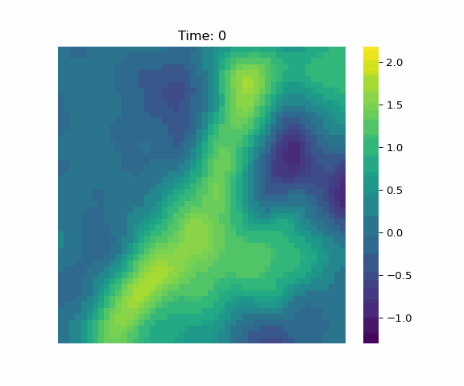

# The Model

| Process                 | Observations        | Kernel                 |
|:-----------------------:|:-------------------:|:----------------------:|
|  |  |  |

The Integro-Difference Equation model, sometimes abbreviated to IDE or, to avoid confusion with integrated development environments, IDEM, is a hierarchical dynamic spatio-temporal model, which can be written

$$
\begin{split}
Z(\mathbf s;t) &= Y(\mathbf s;t) + \epsilon_t(\mathbf s)\\
Y(\mathbf s;t+1) &= \int_{\mathcal D_s} \kappa(s,r;t) Y(r;t) d\mathbf r + \eta_t(\mathbf s).
\end{split}
$$

Here, $Y$, the process, defined over the space $\mathcal D_s$ and discrete time $t=1, \dots, T$ evolves dynamically with respect to discrete time, according to a weighted integral of it's previous state. 
There is also a non-dynamical component $\eta_t(\vec s)$ and measurement error/noise process for the data, $\epsilon_t(\mathbf s)$, all of which are assumed mutually independent in time.

For more rigorous treatment of this model, you can start with the books [Statistics for Spatio-Temporal Data](https://www.wiley.com/en-ie/Statistics+for+Spatio-Temporal+Data-p-9780471692744), [Spatio-Temporal Statistics with R ](https://www.taylorfrancis.com/books/mono/10.1201/9781351769723/spatio-temporal-statistics-christopher-wikle-andrew-zammit-mangion-noel-cressie), and the articles [Data-Driven Spatio-Temporal Modeling Using the Integro-Difference Equation](https://ieeexplore-ieee-org.ezphost.dur.ac.uk/document/4623135), [Deep integro-difference equation models for spatio-temporal forecasting](https://www-sciencedirect-com.ezphost.dur.ac.uk/science/article/pii/S2211675320300026).

This project could also be understood as a re-implementation of [Andrew Zammit Mangion's `R` package `IDE`](https://github.com/andrewzm/IDE), though the hope is that the functionality and speed will surpass that implementation.

For more information, see the [github pages](https://tatephughes.github.io/JAX-IDEM/).

