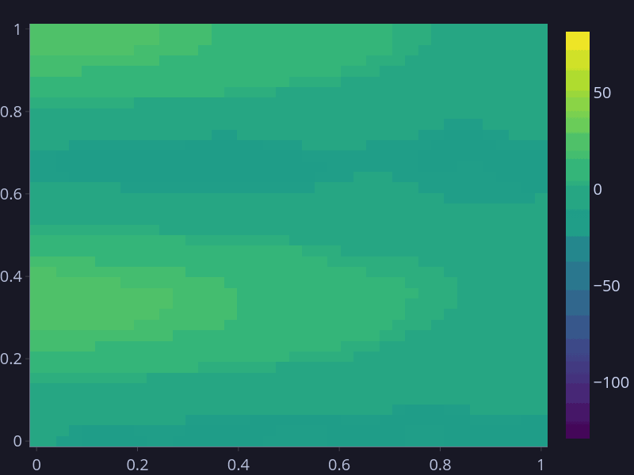
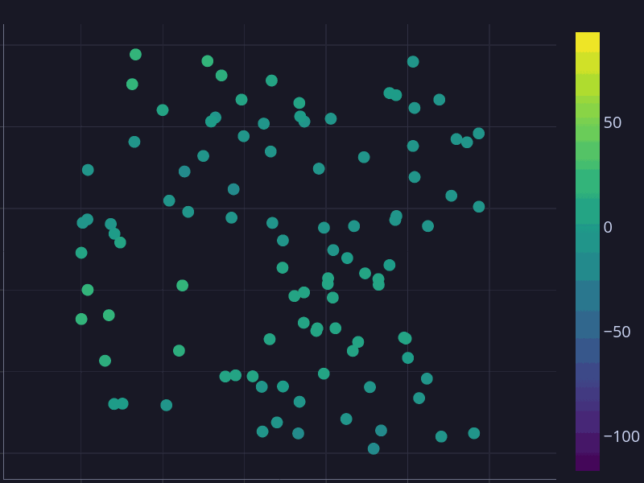
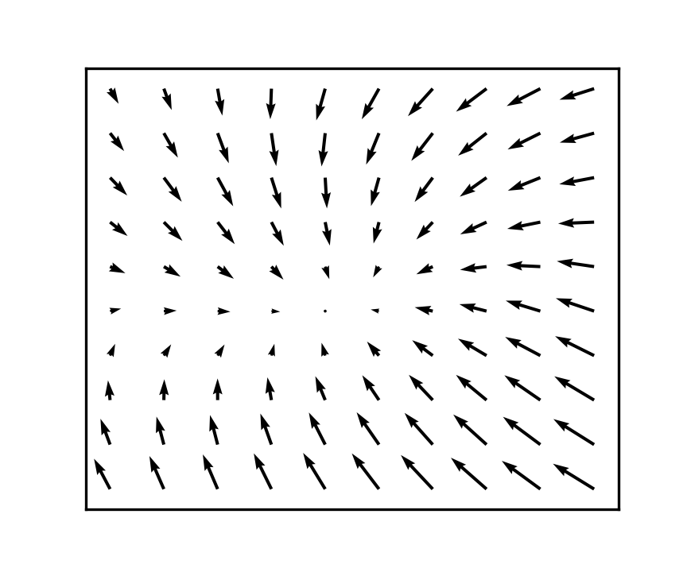

```{python}
#| output: false
#| eval: true

import jax
import os
import jax.numpy as jnp
import jaxidem.utils as utils
import jaxidem.idem as idem
import matplotlib.pyplot as plt
from PIL import Image, ImageSequence
import plotly.graph_objects as go


from jaxidem.plotters import *


seed = 4
key = jax.random.PRNGKey(seed)
keys = jax.random.split(key, 10)

process_basis = utils.place_cosine_basis(N = 10)

#process_basis = utils.place_basis()

sigma2_eta = jnp.diag((0.01*jnp.ones(process_basis.nbasis)).at[1].set(40.0).at[30].set(80.0).at[31].set(60.0))

#sigma2_eta = 0.01

covariate_labels=['Intercept', 'x', 'y']
model = idem.gen_example_idem(keys[0], k_spat_inv=False, ngrid=jnp.array([40, 40]), process_basis = process_basis, sigma2_eta = sigma2_eta, covariate_labels=covariate_labels)

# Simulation
T = 35
nobs = 50

coords = jax.random.uniform(
                keys[0],
                shape=(nobs, 2),
                minval=0,
                maxval=1,
            )

times = jnp.repeat(jnp.arange(1, T + 1), coords.shape[0])
rep_coords = jnp.tile(coords, (T, 1))
x = rep_coords[:,0]
y = rep_coords[:,1]

process_data, obs_data = model.simulate(keys[1], x, y, times,
                                        covariates = jnp.column_stack([x,y]))
dpi = 200
width = 576 / dpi
height = 480 / dpi

# plot the objects
#utils.gif_st_grid(process_data, "site/figure/process.gif", width=width, height=height)
#utils.gif_st_pts(obs_data, "site/figure/obs.gif", width=width, height=height)
#model.kernel.save_plot("site/figure/kernel.png", width=width, height=height)
# 
#gif1 = Image.open('site/figure/process.gif')
#gif2 = Image.open('site/figure/tardis.gif')
#
#width, height = gif1.size
#
#frames = []
#num_frames_gif1 = len(list(ImageSequence.Iterator(gif1)))
#num_frames_gif2 = len(list(ImageSequence.Iterator(gif2)))
#max_frames = max(num_frames_gif1, num_frames_gif2)
#
#for i in range(max_frames):
#    frame1 = ImageSequence.Iterator(gif1)[i % num_frames_gif1].convert("RGBA")
#    frame2 = ImageSequence.Iterator(gif2)[i % num_frames_gif2].convert("RGBA")
#
#    frame2 = frame2.resize((width, height), Image.LANCZOS)
#    
#    combined = Image.alpha_composite(frame1, frame2)
#    frames.append(combined)
#
#
#frames[0].save('site/figure/process.gif', save_all=True, append_images=frames[1:], duration=gif1.info['duration'], loop=0)


proc_frames = plotly_st_grid(process_data)
obs_frames = plotly_st_scatter(obs_data)

proc_fig = make_interactive_fig(proc_frames)
obs_fig = make_interactive_fig(obs_frames)
kernel_fig = kernel_plot(model.kernel)

apply_catppuccin_mocha(proc_fig, fontsize=20)
apply_catppuccin_mocha(obs_fig, fontsize=20)
apply_catppuccin_mocha(kernel_fig, fontsize=20)

save_st_gif(proc_frames, "site/figure/proc2.gif", apply_theme=apply_catppuccin_mocha)
save_st_gif(obs_frames, "site/figure/obs2.gif", apply_theme=apply_catppuccin_mocha)
kernel_fig.write_image("site/figure/kernel.png", format="png", scale=2)

```

::: {#fig-example layout-ncol=3}







An example IDEM simulation, with the underlying process (left), noisy observations randomly placed at each time interval (center), and the direction of 'flow' dictated by the kernel (right).

:::


## The Technicalities

For a rundown of the mathematics underpinning this model and implementation, see [here](site/mathematics.html).

## Documentation

Documentation for the package is available [here](reference/index.html).

## Other sections

<!--[IDEM fit example](site/fit_example.html)-->

[Filtering examples](site/filtering_scaling.html)

[Sydney Radar example](site/Sydney_Radar.html)

