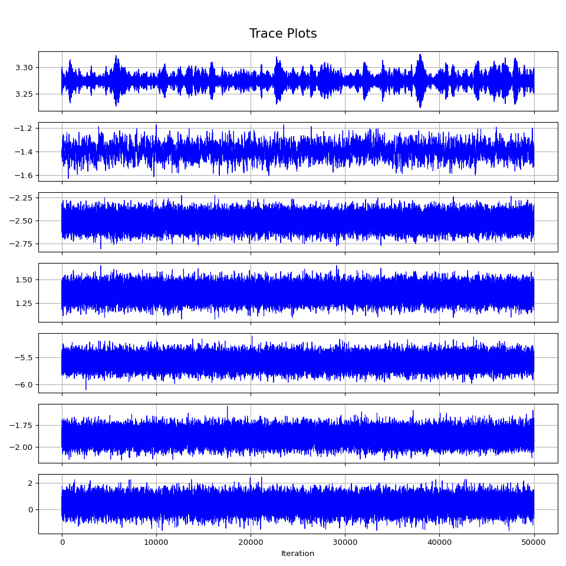
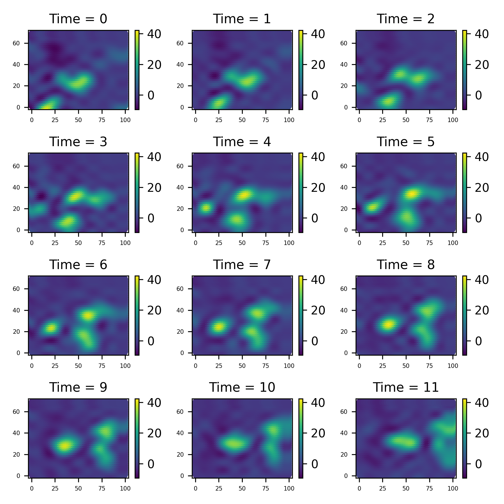
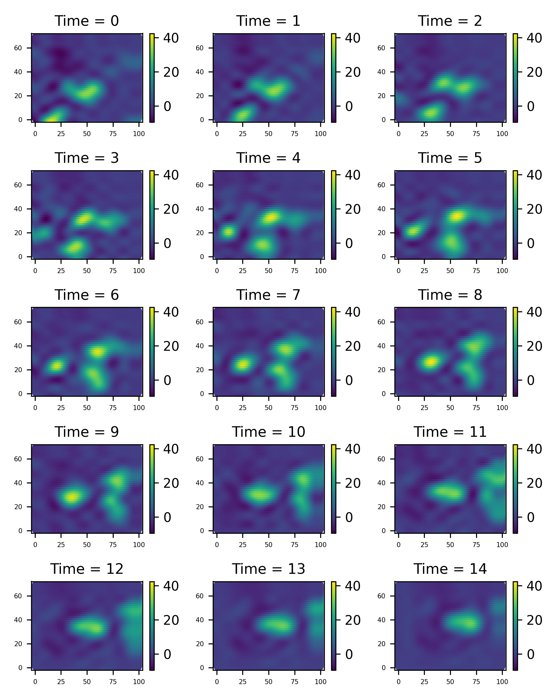
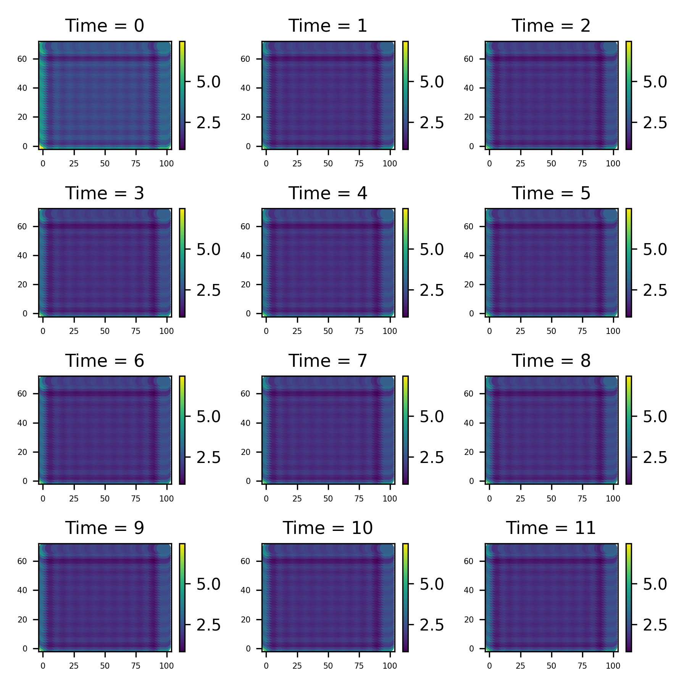

::: {.content-visible unless-format="pdf"}

[Index](../index.html)

:::

# The Sydney Radar Data Set

This is a data set... [more information here and plotting here]

# Importing the relevant packages and Loading the data

Firstly, we load the relevant libraries and import the data.

```{python}

import jax
jax.config.update("jax_enable_x64", True)
import os
import jax.numpy as jnp
import jax.random as rand
import pandas as pd
import jaxidem.idem as idem
import jaxidem.utils as utils
import matplotlib.pyplot as plt
import jaxidem.plotters as plotters

radar_df = pd.read_csv('data/radar_df.csv')

```

We should put this data into `jax-idem`s `st_data` type;

```{python}
#| output: false
radar_data = utils.pd_to_st(radar_df, 's2', 's1', 'time', 'z') 
```

## PLotting

There is an optional module for jaxidem, jaxidem.plotters (install it with `pip install jaxidem[plotters]`) that includes some built-in functions to make plots of various objects relating to modelling. 
Note that this module uses plotly to create interactive html-based plots, primarily for notebooks such as this.
For saving static images of plots, plotly requires kaleido, which itself requires chrome. 
This is the reason that this module is optional, but if you need to install chrome, you can use `plotly_get_chrome` in bash, assuming you are on linux.

The `plotters` module uses the functions `plotly_st_grid` or `plotly_st_scatter` (the former for gridded data, the latter for scattered data) to create a list of frames for each time point. 

The Sydney Radar data are 28x40 images, so we can use the grid version;

```{python}
import jaxidem.plotters as plotters

frames = plotters.plotly_st_grid(radar_data, title="Sydney Radar Data")
```

There are a few ways to then present this data; a static grid of each data points using `make_st_fig`, an interactive plot with a slider to see each time point using `make_interactive_fig`, and a gif using `save_st_gif`. 

To make an interactive plot,

```{python}
sydney_fig = plotters.make_interactive_fig(frames)

# Apply the catppuccin mocha theme to match these notebooks
plotters.apply_catppuccin_mocha(sydney_fig, fontsize = 20)

sydney_fig.update_layout(
    xaxis=dict(showticklabels=False),
    yaxis=dict(showticklabels=False, scaleanchor="x")
)

sydney_fig.show()
```

More options of plotting will be looked at when we do filtering, fitting, and inference on this model.


## Modelling

We will firstly censor the data, so that we can assess the 'blanks' we filled in.

For this example, we have 12 time points. 
We will remove the first, last, and one middle point, to test backcasting, intracasting and forecasting respectively.

Note that, in removing the middle time, our data now has 'varying' observation dimension (we have 28x40 observation points, one for each pixel, at every time point except the middle one, where we have 'dimension 0').
While there is no reason analytically that any Kalman filter variant cannot handle this kind of, case, this functionality is only implemented into the information filters (including the parallel filters) in `jax-idem`.
This is not a problem here however, as the observation dimension is generally much higher than the process dimensions we might choose, so the information filters are much more performant anyway.

```{python}
#| eval: true
# Censor the data!
radar_df_censored = radar_df
# remove the first time measurements (for backcast testing)
radar_df_censored = radar_df_censored[radar_df_censored['time'] != "2000-11-03 08:45:00"]
# remove the a specific time (for intracast testing)
radar_df_censored = radar_df_censored[radar_df_censored['time'] != "2000-11-03 09:25:00"]
# remove the a final two times (for forecast testing)
radar_df_censored = radar_df_censored[~radar_df_censored['time'].isin(["2000-11-03 10:15:00", "2000-11-03 10:05:00"])]
# three randomly chose indices ('dead pixels')

# no covariates (besides intercept)
radar_data = utils.pd_to_st(radar_df_censored, 's2', 's1', 'time', 'z')

# make a new plot to show the missing data

frames = plotters.plotly_st_grid(radar_data, title="Sydney Radar Data")

sydney_fig = plotters.make_st_fig(frames, spacing = [0.01, 0.1])

# Apply the catppuccin mocha theme to match these notebooks
plotters.apply_catppuccin_mocha(sydney_fig, fontsize = 20)

sydney_fig.update_xaxes(title_text=None, showticklabels=False)
sydney_fig.update_yaxes(title_text=None, showticklabels=False)

sydney_fig.update_layout(
    xaxis=dict(showticklabels=False),
    yaxis=dict(showticklabels=False, scaleanchor="x")
)

sydney_fig.show()
```


We now create an initial model for this data 

```{python}
#| output: false
#| eval: false
model = idem.init_model(data=radar_data)
```

This, by default, creates an invariant kernel model with no covariates beside an intercept, with cosine basis function for the process decomposition.
We can now get the marginal data likelihood function of this model with the `get_log_like` method;

```{python}
#| eval: false
log_marginal = model.get_log_like(radar_data, method="sqinf", likelihood='partial')
```

We can then use this function to do various inference techniques, like direclty maximising it or Bayesian MCMC methods. It is auto-differentiation compatible, so can easily be dropped into packages like `optax` or `blackjax` for these purposes.

The function takes, as an input, an object of type `IdemParams`, which is a `NamedTuple` containing the log variances, (transformed) kernel parameters, and the regression coefficients.
The `Model` class has a value of these paramters, `Model.params`, and a method is provided to print these parameters in a clear way;

```{python}
#| output: true
#| eval: false
idem.print_params(model.params)
```

## Maximum Likelihood Estimation

Once we have this marginal likelihood, there are a few ways to progress.
A good start is with a maximum likelihood method.
Obviously, we can no just take this lgo marginal function and maximise it in any way we see fit, but `jaxidem.Model` has a built-in method for this, `Model.fit_mle`. Given data, this will use a method from 'optax' to create a new output model with the fitted parameters.

```{python}
#| eval: false

import optax


fit_model_mle, mle_params = model.fit_mle(radar_data,
                                          optimizer = optax.adam(1e-2),
                                          max_its = 100,
                                          method = 'sqinf')

```

```{python}
#| eval: false
#| echo: false
#| output: false

import pickle
with open('./pickles/Hamilton/24_4_25/mle_params.pkl', 'rb') as file: 
    mle_params = pickle.load(file)
fit_model_mle = model.update(mle_params)
```

The resulting parameters are then

```{python}
#| eval: false
idem.print_params(mle_params)
```

Of course, we can use any other method to maximise this, by using whatever method desired on the function returned from `Model.get_log_liklehood`.
We can update the model with new parameters using the method `Model.update`, and `utils.flatten_and_unflatten` (see documentation) allows working with flat arrays instead of PyTrees if needed.

## Posterior Sampling

It is obviously desirable to use MCMC methods in order to sample from the posterior distribution.
This can be done manually using the log likelihood, or by using the method `Model.sample_posterior`. 
We need to provide it with a sampling kernel; that is, a method to get from one state to the next.


## Using Blackjax

From there, it is easy to sample from the posterior

```{python}
#| eval: false
key = jax.random.PRNGKey(1) # PRNG key
inverse_mass_matrix = jnp.ones(model.nparams)
num_integration_steps = 10
step_size = 1e-5
sample, _ = model.sample_posterior(key,
                                   n=10,
                                   burnin=0,
                                   obs_data=radar_data,
                                   X_obs=[X_obs for _ in range(T)],
                                   inverse_mass_matrix=inverse_mass_matrix,
                                   num_integration_steps=num_integration_steps,
                                   step_size = step_size,
                                   likelihood_method="sqinf",)

```

```{python}
#| eval: false
#| echo: false
#| output: false

import numpy as np
import matplotlib.pyplot as plt

csv_data = np.loadtxt('data/Chains/HMC_chain_32.csv', delimiter=',')
# Convert the NumPy array to a JAX array
sample = jnp.array(csv_data)[10000:60000,1:]

```

```{python}
#| eval: false
#| output: false
num_params = sample.shape[1]
fig, axes = plt.subplots(num_params, 1, figsize=(10, 10), sharex=True)
for i in range(num_params):
    axes[i].plot(sample[:, i], lw=0.8, color='b')
    axes[i].set_ylabel('')
    axes[i].grid(True)
axes[-1].set_xlabel('Iteration')
fig.suptitle('Trace Plots', fontsize=16, y=0.95)
plt.tight_layout(rect=[0, 0, 1, 0.96]) 

plt.savefig('figure/hmc_trace.png')
```

::: {#fig-example layout-ncol=1}



:::

Lets take the posterior mean for some filtering and predicting.

```{python}
#| eval: false
# gets the function used to go from a flat array to a parameter of the type used in the models
fparams, unflatten = utils.flatten_and_unflatten(model.params)

post_mean = jnp.mean(sample, axis=0)
new_params = unflatten(post_mean)

new_model = model.update(new_params)

filt_data, filt_results = new_model.filter(radar_data, forecast = 3, method="kalman")
```

```{python}
#| output: false
#| eval: false
filt_data.save_plot('figure/filtered_plot.png')
```

::: {#fig-filter layout-ncol=1}



:::

We've also forecasted the next 3 time points, and we can get them like this

```{python}
#| eval: false
#nuforecast = filt_results['nuforecast']
#Rforecast = filt_results['Rforecast']
#
#from jax.scipy.linalg import solve_triangular as st

#mforecast = st(Rforecast, nuforecast[..., None]).squeeze(-1)

mforecast = jnp.vstack((filt_results['ms'], filt_results['mforecast']))

# will build this in to the Model.filter method soon!
fore_data = idem.basis_params_to_st_data(mforecast, model.process_basis, model.process_grid)
```


```{python}
#| eval: false
#| output: false
fore_data.save_plot('figure/fore_plot.png')
```

::: {#fig-fore layout-ncol=1}



:::

We can also plot the variances computed in the Kalman filter

```{python}
#| eval: false
Ps = filt_results['Ps']
Pforecast = filt_results['Pforecast']
combined = jnp.concatenate([Ps])#, Pforecast])

PHI = model.PHI_proc

process_variances = PHI @ combined @ PHI.T

marginals = jnp.diagonal(process_variances, axis1=1, axis2=2)

T = marginals.shape[0]

coords = jnp.concatenate([model.process_grid.coords for _ in range(T)])
times = jnp.repeat(jnp.arange(T), model.process_grid.coords.shape[0])
var_data = utils.st_data(x=coords[:, 0], y=coords[:, 1], times=times, z=marginals.ravel())
```

```{python}
#| eval: false
#| output: false
var_data.save_plot('figure/var_plot.png')
```

::: {#fig-fore layout-ncol=1}



:::
