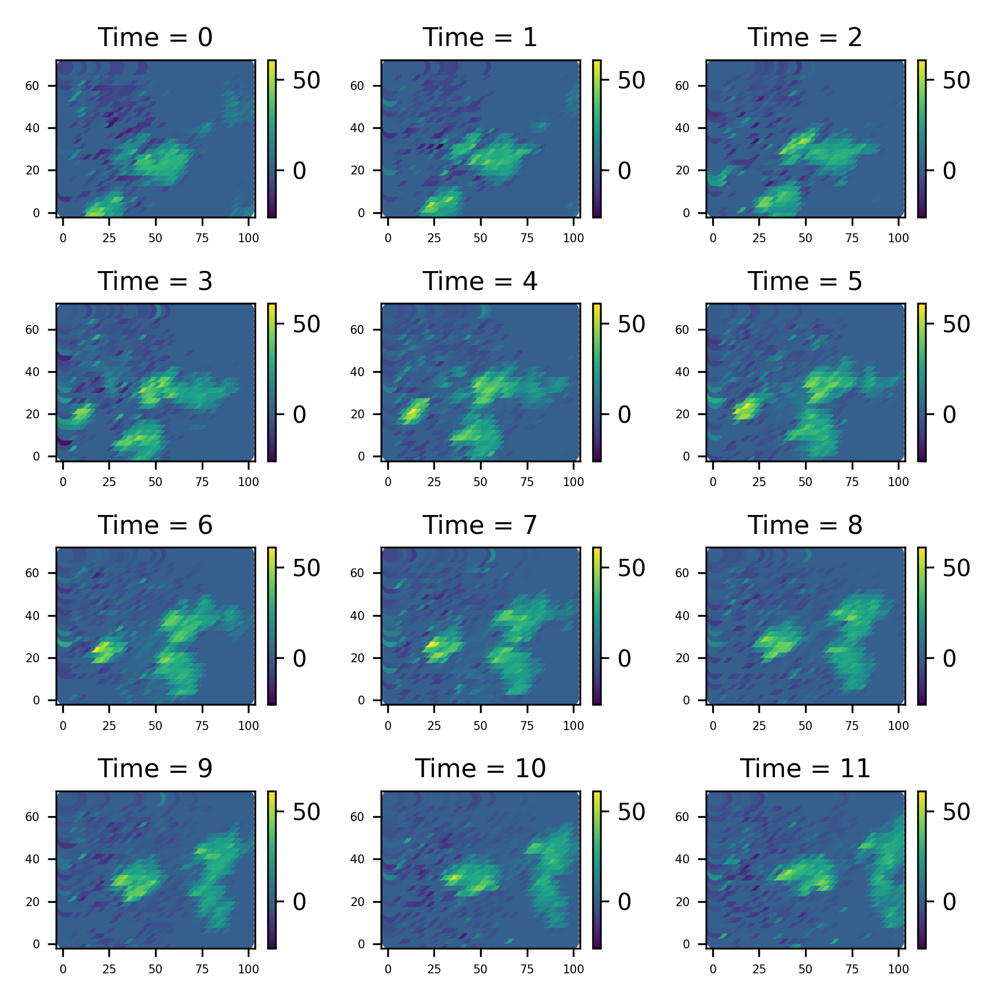

::: {.content-visible unless-format="pdf"}

[Index](../index.html)

:::

# The Sydney Radar Data Set

This is a data set... [more information here and plotting here]

# Importing the relevant packages and Loading the data

Firstly, we load the relevant libraries and import the data.

```{python}

import jax
jax.config.update("jax_enable_x64", True)
import os
import jax.numpy as jnp
import jax.random as rand
import pandas as pd
import jaxidem.idem as idem
import jaxidem.utils as utils
import matplotlib.pyplot as plt

radar_df = pd.read_csv('data/radar_df.csv')

```

We should put this data into `jax-idem`s `st_data` type;

```{python}
#| output: false
radar_data = utils.pd_to_st(radar_df, 's2', 's1', 'time', 'z') 
```

```{python}
# function to make a plot of st_data which lies on a grid

import plotly.graph_objects as go

def plotly_st_grid(st,
                   title="Spatio-Temporal Field",
                   colorscale="Viridis",
                   sort_axes=True,      # sort unique x, y, t; set False to keep first-seen order
                   show_colorbar=True,
                   frame_duration=100,  # ms
                   ):

    # adapted from (and probably stolen by) an llm. Probably rethink or find a proper attributation.
    
    x = st.x
    y = st.y
    z = st.z
    t = st.t

    def unique_axis(vals):
        if sort_axes:
            uniq = jnp.unique(vals)
            to_idx = lambda v: jnp.searchsorted(uniq, v)
        else:
            _, idx = jnp.unique(vals, return_index=True)
            order = jnp.sort(idx)
            uniq = vals[order]
            mapping = {v: i for i, v in enumerate(uniq.tolist())}
            to_idx = lambda v: jnp.fromiter((mapping[vi] for vi in v.tolist()), dtype=int)
        return uniq, to_idx

    ux, xi = unique_axis(x)
    uy, yi = unique_axis(y)
    ut, ti = unique_axis(t)

    if callable(xi):
        xi = xi(x)
        yi = yi(y)
        ti = ti(t)

    nx, ny, nt = len(ux), len(uy), len(ut)

    z_grid = jnp.full((nt, ny, nx), jnp.nan, dtype=float)
    z_grid = z_grid.at[ti, yi, xi].set(z)

    zmin = float(jnp.nanmin(z_grid))
    zmax = float(jnp.nanmax(z_grid))
    
    frames = []
    for i in range(nt):
        frames.append(
            go.Frame(
                name=f"t = {ut[i]}",
                data=[
                    go.Heatmap(
                        z=z_grid[i],
                        x=ux,
                        y=uy,
                        colorscale=colorscale,
                        zmin=zmin,
                        zmax=zmax,
                        colorbar=dict(title="z") if show_colorbar else None,
                        showscale=show_colorbar,
                    )
                ],
            )
        )

    return frames

# Catppuccin Mocha palette
catppuccin_mocha = {
    "base": "#181825",
    "mantle": "#181825",
    "crust": "#11111b",
    "text": "#cdd6f4",
    "subtext1": "#bac2de",
    "surface0": "#313244",
    "surface1": "#45475a",
    "overlay0": "#6c7086",
    "blue": "#89b4fa",
    "lavender": "#b4befe",
    "sky": "#89dceb",
    "teal": "#94e2d5",
    "green": "#a6e3a1",
    "yellow": "#f9e2af",
    "peach": "#fab387",
    "maroon": "#eba0ac",
    "red": "#f38ba8",
    "mauve": "#cba6f7",
    "pink": "#f5c2e7",
    "flamingo": "#f2cdcd",
    "rosewater": "#f5e0dc",
}

def apply_catppuccin_mocha(fig, fontsize):
    fig.update_layout(
        paper_bgcolor=catppuccin_mocha["base"],
        plot_bgcolor=catppuccin_mocha["mantle"],
        font=dict(color=catppuccin_mocha["text"], size=fontsize),
        title_font=dict(color=catppuccin_mocha["text"]),
    )
    fig.update_xaxes(
        showgrid=True, gridcolor=catppuccin_mocha["surface0"],
        zeroline=False, linecolor=catppuccin_mocha["overlay0"], ticks="outside",
        tickfont=dict(color=catppuccin_mocha["subtext1"])
    )
    fig.update_yaxes(
        showgrid=True, gridcolor=catppuccin_mocha["surface0"],
        zeroline=False, linecolor=catppuccin_mocha["overlay0"], ticks="outside",
        tickfont=dict(color=catppuccin_mocha["subtext1"])
    )
    fig.update_layout(
        annotations=[
            ann.update(font=dict(size=fontsize)) or ann
            for ann in fig.layout.annotations
        ]
    )

from plotly.subplots import make_subplots
frames = plotly_st_grid(radar_data)

def make_st_fig(frames, ncols=3, spacing = [0.02, 0.02]):
    
    nframes = len(frames)
    nrows = int(jnp.ceil(nframes / ncols))

    fig = make_subplots(
        rows=nrows, cols=ncols,
        subplot_titles=[f"t = {int(ti)+1}" for ti in range(nframes)],
        horizontal_spacing=spacing[0],
        vertical_spacing=spacing[1]
    )

    for idx, fr in enumerate(frames):
        row = int(jnp.floor(idx /ncols)) + 1
        col = int(idx % ncols) + 1
        fig.add_trace(fr.data[0], row=row, col=col)

    for i in range(1, nrows * ncols + 1):
        fig.update_xaxes(matches='x', row=(i-1)//ncols + 1, col=(i-1)%ncols + 1)
        fig.update_yaxes(matches='y', row=(i-1)//ncols + 1, col=(i-1)%ncols + 1)
            
    # Also anchor y to x for square cells
    for c in range(1, 4):
        fig.update_yaxes(scaleanchor=f"x{c}", row=1, col=c)
    fig.update_xaxes(constrain="domain")
    fig.update_yaxes(scaleanchor="x", scaleratio=1.0)

    return fig

fig =  make_st_fig(frames, spacing=[0.05, 0.08])

fig.update_xaxes(title_text=None)
fig.update_yaxes(title_text=None)

fig.update_layout(
    height=800   # pixels
)
    
apply_catppuccin_mocha(fig, fontsize=20)
fig.update_xaxes(title_text=None, showticklabels=False)
fig.update_yaxes(title_text=None, showticklabels=False)
fig.write_image(
    "figure/sydney_plot.pdf",
#    width=1200,         # in px, scales your figure before PDF render
#    height=800,
    scale=2             # multiplier for crisper text & lines
)
fig.show()

```

```{python}

fig = go.Figure(
    data=frames[0].data,  # initial frame
    frames=frames         # all frames
)

fig.update_layout(
    sliders=[{
        "active": 0,
        "pad": {"t": 50},
        "steps": [{
            "label": f"t = {i}",
            "method": "animate",
            "args": [[f.name], {"mode": "immediate",
                                "frame": {"duration": 0, "redraw": True},
                                "transition": {"duration": 0}}]
        } for i, f in enumerate(frames)]
    }]
)

apply_catppuccin_mocha(fig, fontsize=20)


fig.show()


```

```{python}


import imageio
import os
 

def save_st_gif(frames, filename, apply_theme=apply_catppuccin_mocha):

    # Create a temporary folder
    os.makedirs("frames", exist_ok=True)

    # Save each frame as PNG
    for i, frame in enumerate(frames):
        fig = go.Figure(data=frame.data)
        apply_theme(fig, fontsize=20)
        fig.write_image(f"frames/frame_{i:03d}.png", width=800, height=600)

    # Stitch into GIF
    images = [imageio.imread(f"frames/frame_{i:03d}.png") for i in range(len(frames))]
    imageio.mimsave(filename, images, duration=0.1)  # duration in seconds per frame


save_st_gif(frames, "figure/sydney_gif.gif")
```

## Plotting the data

Firstly, lets take a look at the data set. I is a collection of 12 images taken at evenly spaced intervals. 
We can use the method `st_data.show_plot` to uickly make a plot of data like this;

```{python}
#| output: false
radar_data.save_plot('figure/Sydney_plot.png')
```

::: {#fig-example layout-ncol=1}



:::

## Modelling

We will firstly censor the data, so that we can assess the 'blanks' we filled in.

```{python}
#| eval: false
# Censor the data!
radar_df_censored = radar_df
# remove the final time measurements (for forecast testing)
radar_df_censored = radar_df_censored[radar_df_censored['time'] != "2000-11-03 08:45:00"]
# remove the a specific time (for intracast testing)
radar_df_censored = radar_df_censored[radar_df_censored['time'] != "2000-11-03 10:15:00"]
# three randomly chose indices ('dead pixels')
import numpy as np
np.random.seed(42) # reproducibility (jax.random is used elsewhere)
random_indices = np.random.choice(radar_df_censored.index, size=300, replace=False)
radar_df_censored = radar_df_censored.drop(random_indices)


# no covariates (besides intercept)
radar_data = utils.pd_to_st(radar_df_censored, 's2', 's1', 'time', 'z')
```


We now create an initial model for this data 

```{python}
#| output: false
model = idem.init_model(data=radar_data)
```

This, by default, creates an invariant kernel model with no covariates beside an intercept, with cosine basis function for the process decomposition.
We can now get the marginal data likelihood function of this model with the `get_log_like` method;

```{python}
log_marginal = model.get_log_like(radar_data, method="sqinf", likelihood='partial')
```

We can then use this function to do various inference techniques, like direclty maximising it or Bayesian MCMC methods. It is auto-differentiation compatible, so can easily be dropped into packages like `optax` or `blackjax` for these purposes.

The function takes, as an input, an object of type `IdemParams`, which is a `NamedTuple` containing the log variances, (transformed) kernel parameters, and the regression coefficients.
The `Model` class has a value of these paramters, `Model.params`, and a method is provided to print these parameters in a clear way;

```{python}
#| output: true

idem.print_params(model.params)
```

## Maximum Likelihood Estimation

Once we have this marginal likelihood, there are a few ways to progress.
A good start is with a maximum likelihood method.
Obviously, we can no just take this lgo marginal function and maximise it in any way we see fit, but `jaxidem.Model` has a built-in method for this, `Model.fit_mle`. Given data, this will use a method from 'optax' to create a new output model with the fitted parameters.

```{python}
#| eval: false

import optax


fit_model_mle, mle_params = model.fit_mle(radar_data,
                                          optimizer = optax.adam(1e-2),
                                          max_its = 100,
                                          method = 'sqinf')

```

```{python}
#| eval: true
#| echo: false
#| output: false

import pickle
with open('./pickles/Hamilton/24_4_25/mle_params.pkl', 'rb') as file: 
    mle_params = pickle.load(file)
fit_model_mle = model.update(mle_params)
```

The resulting parameters are then

```{python}
idem.print_params(mle_params)
```

Of course, we can use any other method to maximise this, by using whatever method desired on the function returned from `Model.get_log_liklehood`.
We can update the model with new parameters using the method `Model.update`, and `utils.flatten_and_unflatten` (see documentation) allows working with flat arrays instead of PyTrees if needed.

## Posterior Sampling

It is obviously desirable to use MCMC methods in order to sample from the posterior distribution.
This can be done manually using the log likelihood, or by using the method `Model.sample_posterior`. 
We need to provide it with a sampling kernel; that is, a method to get from one state to the next.


## Using Blackjax

From there, it is easy to sample from the posterior

```{python}
#| eval: false
key = jax.random.PRNGKey(1) # PRNG key
inverse_mass_matrix = jnp.ones(model.nparams)
num_integration_steps = 10
step_size = 1e-5
sample, _ = model.sample_posterior(key,
                                   n=10,
                                   burnin=0,
                                   obs_data=radar_data,
                                   X_obs=[X_obs for _ in range(T)],
                                   inverse_mass_matrix=inverse_mass_matrix,
                                   num_integration_steps=num_integration_steps,
                                   step_size = step_size,
                                   likelihood_method="sqinf",)

```

```{python}
#| eval: true
#| echo: false
#| output: false

import numpy as np
import matplotlib.pyplot as plt

csv_data = np.loadtxt('data/Chains/HMC_chain_32.csv', delimiter=',')
# Convert the NumPy array to a JAX array
sample = jnp.array(csv_data)[10000:60000,1:]

```

```{python}
#| output: false
num_params = sample.shape[1]
fig, axes = plt.subplots(num_params, 1, figsize=(10, 10), sharex=True)
for i in range(num_params):
    axes[i].plot(sample[:, i], lw=0.8, color='b')
    axes[i].set_ylabel('')
    axes[i].grid(True)
axes[-1].set_xlabel('Iteration')
fig.suptitle('Trace Plots', fontsize=16, y=0.95)
plt.tight_layout(rect=[0, 0, 1, 0.96]) 

plt.savefig('figure/hmc_trace.png')
```

::: {#fig-example layout-ncol=1}


:::

Lets take the posterior mean for some filtering and predicting.

```{python}
# gets the function used to go from a flat array to a parameter of the type used in the models
fparams, unflatten = utils.flatten_and_unflatten(model.params)

post_mean = jnp.mean(sample, axis=0)
new_params = unflatten(post_mean)

new_model = model.update(new_params)

filt_data, filt_results = new_model.filter(radar_data, forecast = 3, method="kalman")
```

```{python}
#| output: false
filt_data.save_plot('figure/filtered_plot.png')
```

::: {#fig-filter layout-ncol=1}


:::

We've also forecasted the next 3 time points, and we can get them like this

```{python}
#nuforecast = filt_results['nuforecast']
#Rforecast = filt_results['Rforecast']
#
#from jax.scipy.linalg import solve_triangular as st

#mforecast = st(Rforecast, nuforecast[..., None]).squeeze(-1)

mforecast = jnp.vstack((filt_results['ms'], filt_results['mforecast']))

# will build this in to the Model.filter method soon!
fore_data = idem.basis_params_to_st_data(mforecast, model.process_basis, model.process_grid)
```


```{python}
#| output: false
fore_data.save_plot('figure/fore_plot.png')
```

::: {#fig-fore layout-ncol=1}


:::

We can also plot the variances computed in the Kalman filter

```{python}
Ps = filt_results['Ps']
Pforecast = filt_results['Pforecast']
combined = jnp.concatenate([Ps])#, Pforecast])

PHI = model.PHI_proc

process_variances = PHI @ combined @ PHI.T

marginals = jnp.diagonal(process_variances, axis1=1, axis2=2)

T = marginals.shape[0]

coords = jnp.concatenate([model.process_grid.coords for _ in range(T)])
times = jnp.repeat(jnp.arange(T), model.process_grid.coords.shape[0])
var_data = utils.st_data(x=coords[:, 0], y=coords[:, 1], times=times, z=marginals.ravel())
```

```{python}
#| output: false
var_data.save_plot('figure/var_plot.png')
```

::: {#fig-fore layout-ncol=1}


:::
