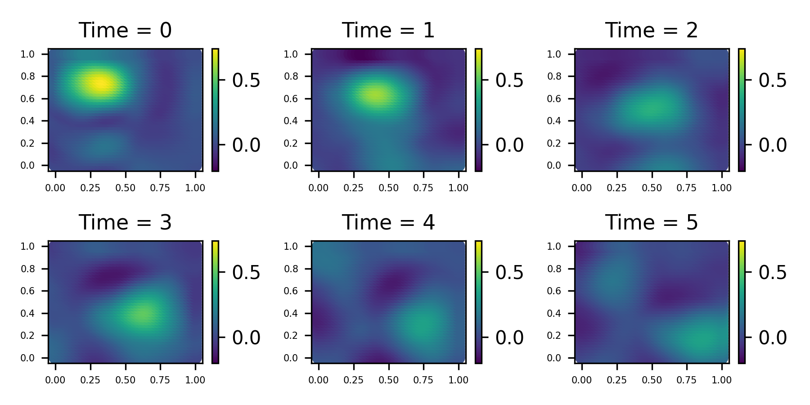
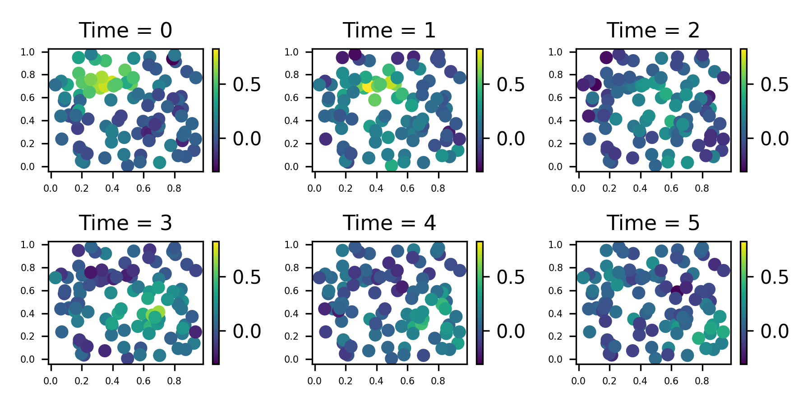
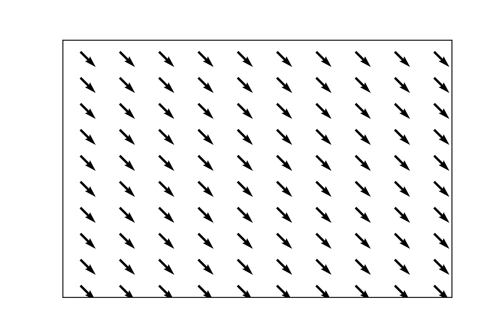

# Simulation

We create a simple model with downward-movement and diffusion, on 16 bisquare basis functions.

```{python}
#| output: false
#| eval: true

import jax
#jax.config.update("jax_enable_x64", True)
import jax.numpy as jnp

import jaxidem.utils as utils
import jaxidem.idem as idem

seed = 4
key = jax.random.PRNGKey(seed)
keys = jax.random.split(key, 10)

process_basis = utils.place_basis(min_knot_num = 5, nres=1, aperture = 1.0) 


# this function creates models like in this example. for practical uses, use `init_model`.
true_model = idem.gen_example_idem(keys[0],
                                   process_basis = process_basis,
                                   beta = jnp.array([0.0]))

# create a 'ball' at the top left 
alpha_0 = jnp.zeros(process_basis.nbasis).at[21].set(1.)


T = 6
nobs = 100

coords = jax.random.uniform(
                keys[0],
                shape=(nobs, 2),
                minval=0,
                maxval=1,
            )
times = jnp.repeat(jnp.arange(1, T + 1), coords.shape[0])
rep_coords = jnp.tile(coords, (T, 1))
x = rep_coords[:,0]
y = rep_coords[:,1]


process_data, obs_data = true_model.simulate(keys[1], x, y, times, alpha_0 = alpha_0)

process_data.save_plot("figure/simple_idem_process.png")
obs_data.save_plot("figure/simple_idem_obs.png")
true_model.kernel.save_plot("figure/simple_idem_kernel.png")

```

::: {#fig-process layout-ncol=3}







An example IDEM simulation, with the underlying process (left), noisy observations randomly placed at each time interval (center), and the direction of 'flow' dictated by the kernel (right). 

:::


Now the parameters of the model can be seen in `Model.params`;

```{python}
idem.print_params(true_model.params)
```

These are the true values of the parameters.
Let's make a new model which we will fit to the truth;

```{python}
model_0 = idem.init_model(obs_data,
                          basis_type = 'bisquare',
                          basis_args=[1, 4], # 1 resolution 4x4 knots
                          k_spat_inv = True)

idem.print_params(model_0.params)
```

In this case, the only parameters that are wrong are the offsets; the direction of flow, and the variances.

In this example, we'll use a strong prior on the shape, scale, and beta; in practical examples, a strong prior on shape and scale, perhaps around the MLE, is usually a good idea.

```{python}

true_params = true_model.params

def log_prior(params):
    return (-0.5*(params.trans_kernel_params[0] - true_params.trans_kernel_params[0])**2/0.1**2
            -0.5*(params.trans_kernel_params[1] - true_params.trans_kernel_params[1])**2/0.1**2
#            -0.5*(params.trans_kernel_params[2] - 0.0)**2/3**2
#            -0.5*(params.trans_kernel_params[3] - 0.0)**2/3**2
            -0.5*(params.beta - true_params.beta)**2/0.1**2)[0]

```

We can now get the marginal log-likelihood, and construct the log posterior

```{python}
log_marginal = model_0.get_log_like(obs_data, method="sqinf", likelihood='partial')


def log_post(params): return log_prior(params) + log_marginal(params)
```

We can know do with this anything; for example, here is a NUTS chain from BLACKJAX

```{python}

rng_key = jax.random.PRNGKey(42)

import blackjax

step_size = 1e-2
imm = jnp.ones(model_0.nparams)

nuts = blackjax.nuts(log_post, step_size, imm)

init_nuts_state = nuts.init(model_0.params)

def nuts_step(state, key):
    new_state,_ = nuts.step(key, state)
    return new_state, new_state

n = 50
keys = jax.random.split(rng_key, n)

_, chain = jax.lax.scan(nuts_step, init_nuts_state, keys)

```

We can extract the offset parameters like so, and make a trajectory plot from them;

```{python}
offset_sample = jnp.hstack(chain.position.trans_kernel_params[2:])

res_mean = jnp.mean(offset_sample, axis=0)
res_cov = jnp.cov(offset_sample.T)


print(res_mean)
print(res_cov)

```

```{python}
#| code-fold: true
import plotly.graph_objects as go

x, y = offset_sample[:, 0], offset_sample[:, 1]

fig = go.Figure()

# Add trajectory line
fig.add_trace(go.Scatter(
    x=x, y=y,
    mode='lines+markers',
    line=dict(color='blue'),
    marker=dict(size=2),
    name='Trajectory'
))

fig.add_trace(go.Scatter(
    x=[x[0]], y=[y[0]],
    mode='markers',
    marker=dict(size=10, color='green'),
    name='Start'
))


fig.add_trace(go.Scatter(
    x=[-0.1], y=[0.1],
    mode='markers',
    marker=dict(size=10, color='yellow'),
    name='Truth'
))

fig.add_trace(go.Scatter(
    x=[x[-1]], y=[y[-1]],
    mode='markers',
    marker=dict(size=10, color='red'),
    name='End'
))

# Layout settings
fig.update_layout(
    title='HMC Trajectory',
    xaxis_title='X_1',
    yaxis_title='X_2',
    showlegend=True,
    width=700,
    height=600
)

fig.show()
```


# Simulation

We create a simple model with downward-movement and diffusion, on 16 bisquare basis functions.

```{python}
#| output: false
#| eval: true

import jax
jax.config.update("jax_enable_x64", True)
import jax.numpy as jnp

import jaxidem.utils as utils
import jaxidem.idem as idem

seed = 4
key = jax.random.PRNGKey(seed)
keys = jax.random.split(key, 10)

process_basis = utils.place_basis(min_knot_num = 5, nres=1, aperture = 1.0) 


# this function creates models like in this example. for practical uses, use `init_model`.
true_model = idem.gen_example_idem(keys[0],
                                   process_basis = process_basis,
                                   beta = jnp.array([0.0]))

# create a 'ball' at the top left 
alpha_0 = jnp.zeros(process_basis.nbasis).at[21].set(1.)


T = 6
nobs = 100

coords = jax.random.uniform(
                keys[0],
                shape=(nobs, 2),
                minval=0,
                maxval=1,
            )
times = jnp.repeat(jnp.arange(1, T + 1), coords.shape[0])
rep_coords = jnp.tile(coords, (T, 1))
x = rep_coords[:,0]
y = rep_coords[:,1]


process_data, obs_data = true_model.simulate(keys[1], x, y, times, alpha_0 = alpha_0)

process_data.save_plot("figure/simple_idem_process.png")
obs_data.save_plot("figure/simple_idem_obs.png")
true_model.kernel.save_plot("figure/simple_idem_kernel.png")

```

::: {#fig-process layout-ncol=3}


An example IDEM simulation, with the underlying process (left), noisy observations randomly placed at each time interval (center), and the direction of 'flow' dictated by the kernel (right). 

:::


Now the parameters of the model can be seen in `Model.params`;

```{python}
idem.print_params(true_model.params)
```

These are the true values of the parameters.
Let's make a new model which we will fit to the truth;

```{python}
model_0 = idem.init_model(obs_data,
                          basis_type = 'bisquare',
                          basis_args=[1, 4], # 1 resolution 4x4 knots
                          k_spat_inv = True)

idem.print_params(model_0.params)
```

In this case, the only parameters that are wrong are the offsets; the direction of flow, and the variances.

In this example, we'll use a strong prior on the shape, scale, and beta; in practical examples, a strong prior on shape and scale, perhaps around the MLE, is usually a good idea.

```{python}

true_params = true_model.params

def log_prior(params):
    return (-0.5*(params.trans_kernel_params[0] - true_params.trans_kernel_params[0])**2/0.1**2
            -0.5*(params.trans_kernel_params[1] - true_params.trans_kernel_params[1])**2/0.1**2
#            -0.5*(params.trans_kernel_params[2] - 0.0)**2/3**2
#            -0.5*(params.trans_kernel_params[3] - 0.0)**2/3**2
            -0.5*(params.beta - true_params.beta)**2/0.1**2)[0]

```

We can now get the marginal log-likelihood, and construct the log posterior

```{python}
log_marginal = model_0.get_log_like(obs_data, method="sqinf", likelihood='partial')


def log_post(params): return log_prior(params) + log_marginal(params)
```

We can know do with this anything; for example, here is a NUTS chain from BLACKJAX

```{python}

rng_key = jax.random.PRNGKey(42)

import blackjax

step_size = 1e-2
imm = jnp.ones(model_0.nparams)

nuts = blackjax.nuts(log_post, step_size, imm)

init_nuts_state = nuts.init(model_0.params)

def nuts_step(state, key):
    new_state,_ = nuts.step(key, state)
    return new_state, new_state

n = 50
keys = jax.random.split(rng_key, n)

_, chain = jax.lax.scan(nuts_step, init_nuts_state, keys)

```

We can extract the offset parameters like so, and make a trajectory plot from them;

```{python}
offset_sample = jnp.hstack(chain.position.trans_kernel_params[2:])

res_mean = jnp.mean(offset_sample, axis=0)
res_cov = jnp.cov(offset_sample.T)


print(res_mean)
print(res_cov)

```

```{python}
#| code-fold: true
import plotly.graph_objects as go

x, y = offset_sample[:, 0], offset_sample[:, 1]

fig = go.Figure()

# Add trajectory line
fig.add_trace(go.Scatter(
    x=x, y=y,
    mode='lines+markers',
    line=dict(color='blue'),
    marker=dict(size=2),
    name='Trajectory'
))

fig.add_trace(go.Scatter(
    x=[x[0]], y=[y[0]],
    mode='markers',
    marker=dict(size=10, color='green'),
    name='Start'
))


fig.add_trace(go.Scatter(
    x=[-0.1], y=[0.1],
    mode='markers',
    marker=dict(size=10, color='yellow'),
    name='Truth'
))

fig.add_trace(go.Scatter(
    x=[x[-1]], y=[y[-1]],
    mode='markers',
    marker=dict(size=10, color='red'),
    name='End'
))

# Layout settings
fig.update_layout(
    title='HMC Trajectory (64 bit)',
    xaxis_title='X_1',
    yaxis_title='X_2',
    showlegend=True,
    width=700,
    height=600
)

fig.show()
```
